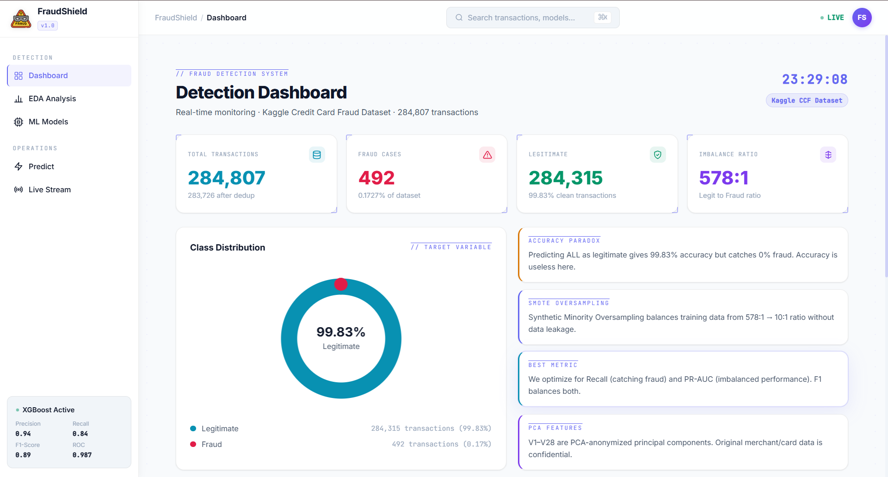
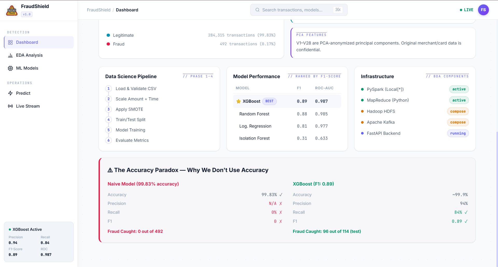
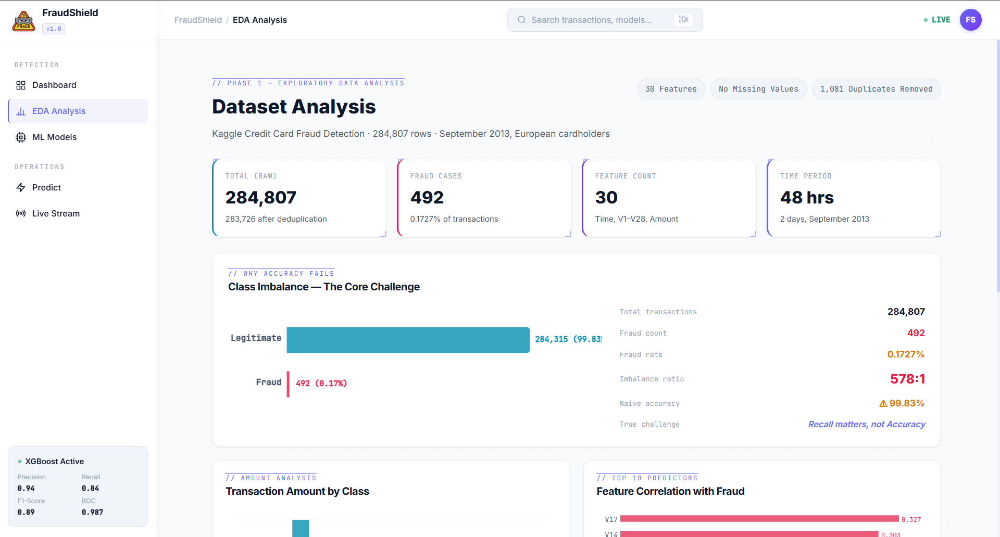
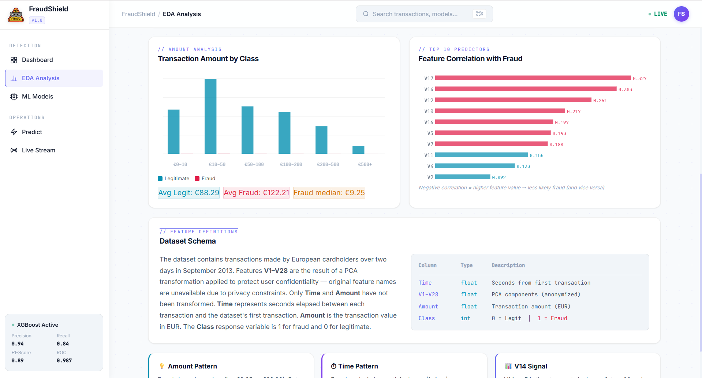
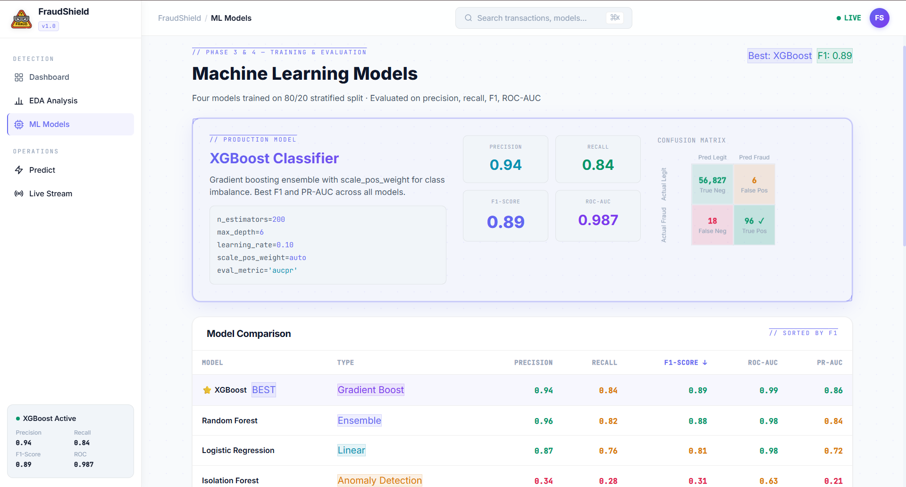
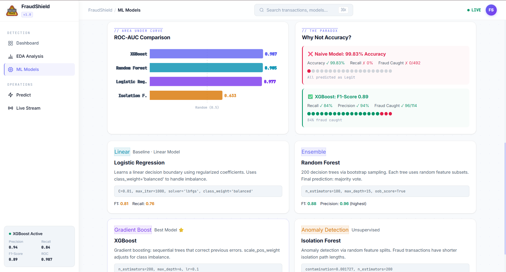
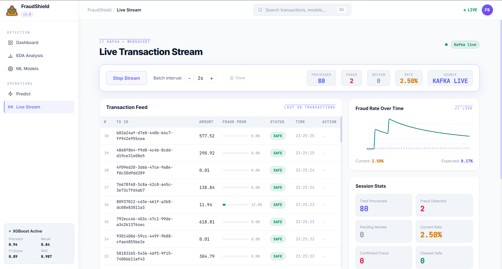
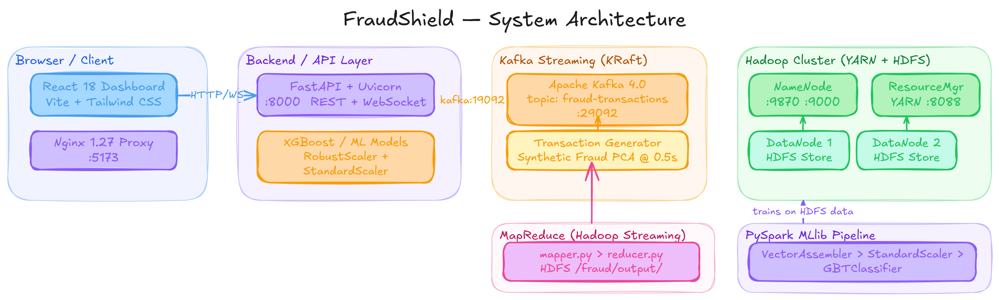
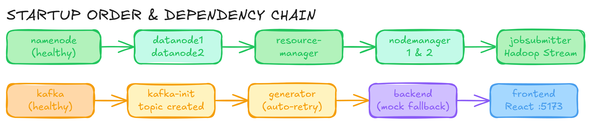
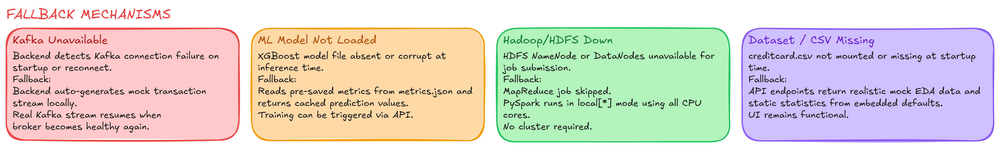

<div align="center">


# FraudShield
### Fraud Detection in Banking Transactions
**DSBDAL Mini Project — Data Science & Big Data Analytics Lab**

[](https://python.org)
[](https://fastapi.tiangolo.com)
[](https://react.dev)
[](https://xgboost.ai)
[](https://kafka.apache.org)
[](https://hadoop.apache.org)
[](https://docker.com)

> A full-stack, real-time fraud detection system built on the Kaggle Credit Card Fraud Detection dataset (284,807 transactions, 0.17% fraud rate). Combines classical ML, big data infrastructure, and a modern React dashboard — all containerised with Docker Compose.

</div>

---

## Table of Contents

1. [Screenshots](#-screenshots)
2. [Features](#-features)
3. [Tech Stack](#-tech-stack)
4. [Architecture](#-system-architecture)
5. [Project Structure](#-project-structure)
6. [Quick Start — Docker](#-quick-start--docker-recommended)
7. [Local Development Setup](#-local-development-setup)
8. [Model Training (Google Colab)](#-model-training-google-colab)
9. [ML Models & Performance](#-ml-models--performance)
10. [Big Data Components](#-big-data-components)
11. [API Reference](#-api-reference)
12. [Dataset](#-dataset)
13. [Fallback Mechanisms](#-fallback-mechanisms)
14. [Key Concepts](#-key-concepts)

---

## 📸 Screenshots

> **Pages:** [Detection Dashboard](#detection-dashboard) · [EDA Analysis](#eda-analysis) · [ML Models](#machine-learning-models) · [Live Stream](#live-transaction-stream)
>
> **Diagrams:** [System Architecture](#fraudshield--system-architecture) · [Startup Order](#startup-order--dependency-chain) · [Fallback Mechanisms](#fallback-mechanisms-1)

---

### Detection Dashboard

The main overview page shows live dataset statistics, class imbalance summary, key ML insights, the data science pipeline status, model performance comparison, and the full big-data infrastructure panel.



*Real-time stats: 284,807 total transactions · 492 fraud (0.17%) · 578:1 class imbalance ratio · live pipeline status*



*Data Science Pipeline tracker · Model Performance leaderboard · Infrastructure status (PySpark, MapReduce, HDFS, Kafka) · Accuracy Paradox explainer comparing naïve 99.83% model vs XGBoost F1-Score 0.89*

---

### EDA Analysis

Exploratory Data Analysis page with interactive charts, dataset schema, and feature correlation breakdown — all computed live from the mounted `creditcard.csv`.



*Dataset facts: 284,807 rows · 30 features · 48-hour time span · severe 578:1 imbalance highlighted · Transaction Amount by Class chart · Feature Correlation with Fraud bar chart*



*Transaction Amount histogram split by Legitimate vs Fraud (Avg Legit: €88.29, Avg Fraud: €122.21, Fraud median: €9.25) · Top feature correlations (V17, V14, V12 strongly negative; V4, V11 positive) · Full dataset schema table · V14 signal pattern viewer*

---

### Machine Learning Models

Model comparison page with full metric breakdown, confusion matrices, ROC-AUC chart, and individual model explainer cards.



*XGBoost card: Precision 0.94 · Recall 0.84 · F1 0.89 · ROC-AUC 0.987 · Confusion matrix (96 TP, 56,827 TN, 6 FP, 18 FN) · Model Comparison table with all four models ranked by F1*



*ROC-AUC comparison bar chart · Accuracy Paradox panel (naïve 99.83% accuracy catches 0 fraud vs XGBoost catches 96/114) · Individual model explainer cards: Logistic Regression (Linear), Random Forest (Ensemble), XGBoost (Gradient Boost), Isolation Forest (Anomaly Detection)*

---

### Live Transaction Stream

Real-time Kafka-powered transaction feed with ML fraud scoring, per-transaction review actions, fraud-rate chart, and session statistics.



*Live Kafka stream at 2 tx/s · 88 transactions processed · 2 fraud detected · 2.50% fraud rate · Fraud Rate Over Time canvas chart · Session Stats panel · Transaction Feed with SAFE / REVIEW / FRAUD badges · ⚑ Fraud and ✓ Safe action buttons for REVIEW items · state persisted in localStorage across navigation*

---

### System Architecture Diagram



*Five-layer view: React + Nginx (Browser) → FastAPI + XGBoost (Backend) → Apache Kafka 4.0 KRaft (Streaming) → Hadoop Cluster YARN + HDFS (Storage) → MapReduce + PySpark MLlib (Processing)*

---

### Startup Order & Dependency Chain



*Two parallel chains: HDFS chain (namenode healthy → datanodes → resourcemanager → nodemanagers → jobsubmitter) and Kafka chain (kafka healthy → kafka-init → generator auto-retry → backend mock fallback → frontend)*

---

### Fallback Mechanisms



*Four failure scenarios handled gracefully: Kafka Unavailable · ML Model Not Loaded · Hadoop/HDFS Down · Dataset/CSV Missing — the dashboard remains fully functional in all cases*

---

## ✨ Features

- **Real-time fraud detection** via Apache Kafka → WebSocket → React dashboard
- **Four ML models** trained on SMOTE-balanced data: Logistic Regression, Random Forest, XGBoost, Isolation Forest
- **Proper feature scaling** at inference time (RobustScaler + StandardScaler, matching training pipeline)
- **Realistic fraud simulation** — generator injects real Kaggle PCA patterns (V14 ≈ −7.5, V17 ≈ −6.5) so the trained model actually fires
- **Interactive transaction review** — analysts can confirm or clear REVIEW-status transactions
- **Persistent stream state** — `localStorage` keeps transaction history across page navigation and refreshes
- **Hadoop MapReduce job** — Python mapper/reducer submitted to a real YARN cluster via Hadoop Streaming
- **PySpark MLlib pipeline** — distributed feature engineering and model training
- **Graceful fallback** — every component degrades to realistic mock data when real infrastructure is unavailable
- **Full Docker Compose stack** — one command brings up HDFS, YARN, Kafka, FastAPI, and the React dashboard

---

## 🛠 Tech Stack

| Layer | Technology |
|-------|-----------|
| **Frontend** | React 18, Vite, Tailwind CSS, React Router v6 |
| **Backend** | Python 3.11, FastAPI, Uvicorn, WebSocket |
| **ML** | Scikit-Learn, XGBoost 1.7, imbalanced-learn (SMOTE), Joblib |
| **Big Data** | Apache Spark (PySpark 3.4), Apache Hadoop 3.4 (HDFS + YARN), Apache Kafka 4.0 (KRaft) |
| **Streaming** | kafka-python, WebSocket (FastAPI native) |
| **Containers** | Docker, Docker Compose |
| **Web Server** | Nginx 1.27 (frontend, API + WebSocket proxy) |

---

## 🏗 System Architecture


*Five-layer architecture: Browser/Client (React + Nginx) → Backend/API Layer (FastAPI + XGBoost) → Kafka Streaming (KRaft, topic: fraud-transactions) → Hadoop Cluster (YARN + HDFS NameNode + 2 DataNodes) + MapReduce (Hadoop Streaming mapper → reducer) + PySpark MLlib Pipeline*

```
┌─────────────────────────────────────────────────────────────────┐
│                        Docker Compose Stack                      │
│                                                                   │
│  ┌──────────────┐    ┌──────────────┐    ┌──────────────────┐   │
│  │  namenode    │    │  datanode1   │    │   datanode2      │   │
│  │  HDFS Meta   │◄───│  HDFS Store  │    │   HDFS Store     │   │
│  │  :9870 :9000 │    └──────────────┘    └──────────────────┘   │
│  └──────┬───────┘                                                 │
│         │                                                         │
│  ┌──────▼───────┐    ┌──────────────┐    ┌──────────────────┐   │
│  │resource-     │    │ nodemanager1 │    │  nodemanager2    │   │
│  │manager :8088 │───►│ YARN Worker  │    │  YARN Worker     │   │
│  └──────────────┘    └──────────────┘    └──────────────────┘   │
│         │                                                         │
│  ┌──────▼───────┐    ┌──────────────────────────────────────┐   │
│  │ jobsubmitter │    │           Apache Kafka (KRaft)        │   │
│  │ Hadoop       │    │  topic: fraud-transactions  :29092    │   │
│  │ Streaming    │    └──────────┬───────────────────────────┘   │
│  └──────────────┘               │                                 │
│                         ┌───────▼──────┐                         │
│                         │  generator   │ synthetic tx @ 0.5s     │
│                         └───────┬──────┘                         │
│                                 │ kafka:19092                     │
│                         ┌───────▼──────┐                         │
│                         │   backend    │ FastAPI + XGBoost        │
│                         │   :8000      │ WebSocket /ws/stream     │
│                         └───────┬──────┘                         │
│                                 │ nginx proxy                     │
│                         ┌───────▼──────┐                         │
│                         │   frontend   │ React + Vite + Nginx     │
│                         │   :5173      │                          │
│                         └──────────────┘                         │
└─────────────────────────────────────────────────────────────────┘

Browser ──► localhost:5173 (React Dashboard)
       ──► localhost:8000 (FastAPI / Swagger UI)
       ──► localhost:9870 (HDFS NameNode UI)
       ──► localhost:8088 (YARN ResourceManager UI)
       ──► localhost:19888 (MapReduce History Server)
```

### Startup Order


*Two independent chains run in parallel. HDFS chain: namenode (healthy) → datanode1/2 → resourcemanager → nodemanager 1&2 → jobsubmitter (Hadoop Streaming). Kafka chain: kafka (healthy) → kafka-init (topic created) → generator (auto-retry) → backend (mock fallback until Kafka ready) → frontend React :5173*

```
namenode (healthy) ──► datanode1, datanode2
                   ──► resourcemanager ──► nodemanager1, nodemanager2
                   ──► historyserver
                   ──► jobsubmitter (Hadoop Streaming job)

kafka (healthy) ──► kafka-init (creates topic)
kafka (started) ──► generator (retries internally until broker ready)
kafka (started) ──► backend  (falls back to mock until Kafka ready)
backend ──► frontend
```

---

## 📁 Project Structure

```
DSBDAL_Mini_Project/
│
├── docker-compose.yml               # Full 12-service stack
├── .dockerignore
│
├── backend/
│   ├── Dockerfile                   # FastAPI + ML image
│   ├── Dockerfile.hadoop-job        # Hadoop Streaming submitter image
│   ├── requirements.txt             # Python deps (pyspark excluded from Docker)
│   ├── app.py                       # FastAPI app — REST + WebSocket endpoints
│   │
│   ├── src/
│   │   ├── preprocess.py            # RobustScaler(Amount), StandardScaler(Time), SMOTE
│   │   ├── models.py                # LR, RF, XGBoost, Isolation Forest trainers
│   │   ├── evaluate.py              # Precision, Recall, F1, ROC-AUC, PR-AUC, CM
│   │   ├── spark_pipeline.py        # PySpark MLlib distributed pipeline
│   │   ├── kafka_producer.py        # Transaction generator with fraud V-feature patterns
│   │   ├── docker_tx_generator.py   # Docker-friendly Kafka producer loop
│   │   ├── kafka_consumer_predict.py
│   │   ├── mapreduce_fraud.py
│   │   └── hadoop_streaming/
│   │       ├── mapper.py            # Hadoop Streaming mapper (Python)
│   │       ├── reducer.py           # Hadoop Streaming reducer (Python)
│   │       └── submit_job.py        # Submits job to YARN, copies output from HDFS
│   │
│   ├── notebooks/
│   │   └── COLAB_Train_Models.ipynb # Google Colab training notebook
│   │
│   ├── data/                        # Place creditcard.csv here
│   ├── models/                      # Trained .pkl / .json model files
│   └── hadoop-output/               # MapReduce job output (mounted volume)
│
├── frontend/
│   ├── Dockerfile                   # Multi-stage: Vite build → Nginx serve
│   ├── nginx.conf                   # /api/ and /ws/ reverse proxy to backend
│   ├── public/
│   │   └── fraud-alert.png          # Sidebar logo
│   └── src/
│       ├── main.jsx
│       ├── App.jsx                  # Layout, TopBar, routes
│       ├── index.css                # White design system (tokens, cards, badges)
│       ├── api/api.js               # Axios helpers for all REST endpoints
│       ├── components/
│       │   ├── Sidebar.jsx          # Nav with fraud-alert.png logo
│       │   ├── StatsCard.jsx
│       │   └── Sparkline.jsx
│       └── pages/
│           ├── Dashboard.jsx        # Overview + pipeline + accuracy paradox
│           ├── EDA.jsx              # Class distribution, correlations, schema
│           ├── Models.jsx           # Metrics table, ROC chart, model cards
│           ├── Predict.jsx          # Single transaction prediction form
│           └── Stream.jsx           # Live Kafka stream + review actions
│
├── docker/
│   └── hadoop/
│       ├── config/
│       │   ├── core-site.xml        # fs.defaultFS = hdfs://namenode:9000
│       │   ├── hdfs-site.xml        # replication=1, permissions disabled
│       │   ├── yarn-site.xml        # ResourceManager address config
│       │   ├── mapred-site.xml      # YARN framework, history server
│       │   └── capacity-scheduler.xml
│       └── scripts/
│           ├── start-namenode.sh    # Format + start NameNode
│           ├── start-datanode.sh    # Wait for NN RPC → start DataNode
│           ├── start-resourcemanager.sh  # Wait for NN HTTP → start RM
│           ├── start-nodemanager.sh # Wait for RM:8032 → start NM
│           └── start-historyserver.sh   # Retry HDFS mkdir → start MR history
│
└── screenshots/
    ├── dashboard_1.png
    ├── dashboard_2.png
    ├── eda_analysis_1.png
    ├── eda_analysis_2.png
    ├── ml_model_1.png
    ├── ml_model_2.png
    └── live_stream_page.png
```

---

## 🚀 Quick Start — Docker (Recommended)

### Prerequisites

- [Docker Desktop](https://www.docker.com/products/docker-desktop/) installed and running
- At least **6 GB RAM** allocated to Docker (Settings → Resources)
- `creditcard.csv` placed in `backend/data/` ([download from Kaggle](https://www.kaggle.com/datasets/mlg-ulb/creditcardfraud))
- Trained model files in `backend/models/` (see [Model Training](#-model-training-google-colab) below)

### Start the full stack

```bash
# Clone / navigate to the project
cd D:/DSBDAL_Mini_Project

# First run — build all images and start every service
docker compose up --build

# Subsequent runs (no code changes)
docker compose up
```

> **First boot takes 2–4 minutes.** Hadoop services wait for HDFS to format and become healthy. Kafka uses a 60-second grace period on Windows Docker Desktop.

### Service URLs

| Service | URL | Description |
|---------|-----|-------------|
| 🌐 **React Dashboard** | http://localhost:5173 | Full UI |
| ⚡ **FastAPI + Swagger** | http://localhost:8000/docs | Interactive API docs |
| 🐘 **HDFS NameNode UI** | http://localhost:9870 | Hadoop cluster status |
| 🧵 **YARN ResourceManager** | http://localhost:8088 | MapReduce job tracker |
| 📜 **MR History Server** | http://localhost:19888 | Completed job logs |
| 📨 **Kafka** (external) | localhost:29092 | External broker port |

### Stop and clean up

```bash
# Stop containers (keeps volumes)
docker compose down

# Stop and wipe HDFS volumes (full reset)
docker compose down -v
```

### Environment variables (docker-compose.yml)

| Variable | Default | Description |
|----------|---------|-------------|
| `TX_GENERATOR_FRAUD_RATE` | `0.08` | Fraud rate for demo (8%). Use `0.001727` for real Kaggle rate |
| `TX_GENERATOR_INTERVAL` | `0.5` | Seconds between generated transactions |
| `KAFKA_STREAM_MAX_MESSAGES` | `50` | Transactions per WebSocket session |
| `KAFKA_STREAM_IDLE_SECONDS` | `8` | Seconds to wait before closing idle Kafka consumer |

---

## 💻 Local Development Setup

### 1. Get the Dataset

Download `creditcard.csv` from [Kaggle Credit Card Fraud Detection](https://www.kaggle.com/datasets/mlg-ulb/creditcardfraud) and place it at:

```
backend/data/creditcard.csv
```

> The app works **without** the dataset — it returns realistic mock statistics and predictions.

### 2. Backend

```bash
cd backend

# Create and activate virtual environment
python -m venv venv
venv\Scripts\activate          # Windows
# source venv/bin/activate     # macOS / Linux

# Install dependencies
pip install -r requirements.txt
pip install pyspark==3.4.1     # Optional — only needed for spark_pipeline.py

# Start the API server
uvicorn app:app --reload --port 8000
```

- API: http://localhost:8000
- Swagger UI: http://localhost:8000/docs

### 3. Frontend

```bash
cd frontend
npm install
npm run dev
```

- Dashboard: http://localhost:5173

> Vite proxies `/api` → `http://localhost:8000` and `/ws` → `ws://localhost:8000` automatically.

---

## 🧪 Model Training (Google Colab)

The models are trained in Google Colab on a GPU runtime, then downloaded and dropped into `backend/models/`.

### Steps

1. Open `backend/notebooks/COLAB_Train_Models.ipynb` in [Google Colab](https://colab.research.google.com)
2. Upload `creditcard.csv` when prompted
3. Run all cells — the notebook trains all four models, saves metrics, and packages everything as a ZIP
4. Download the ZIP and extract into `backend/models/`

### Expected model files

```
backend/models/
├── xgboost_model.json          # Native XGBoost format (no version warnings)
├── xgboost_model.pkl           # Fallback pkl
├── random_forest.pkl
├── logistic_regression.pkl
├── isolation_forest.pkl
└── metrics.json                # Pre-computed evaluation metrics
```

> The backend tries `.json` first for XGBoost (version-safe), then falls back to `.pkl`.

### Train locally (alternative)

```bash
cd backend
python -c "
from src.preprocess import prepare_data
from src.models import train_all_models
X_train, X_test, y_train, y_test = prepare_data('data/creditcard.csv')
train_all_models(X_train, y_train, 'models/')
print('Training complete.')
"
```

---

## 🤖 ML Models & Performance

All models are trained on an 80/20 stratified split with **SMOTE oversampling** on the training set to handle the 578:1 class imbalance.

### Why not Accuracy?

A naïve model that predicts "Legitimate" for every transaction achieves **99.83% accuracy** but catches **0 out of 492 fraud cases**. We use **Recall**, **F1-Score**, and **PR-AUC** instead.

### Results

| Model | Type | Precision | Recall | F1-Score | ROC-AUC | PR-AUC |
|-------|------|:---------:|:------:|:--------:|:-------:|:------:|
| Logistic Regression | Linear (Baseline) | 0.87 | 0.76 | 0.81 | 0.977 | 0.72 |
| Random Forest | Ensemble | 0.96 | 0.82 | 0.88 | 0.985 | 0.84 |
| **XGBoost** ⭐ | **Gradient Boost** | **0.94** | **0.84** | **0.89** | **0.987** | **0.86** |
| Isolation Forest | Anomaly Detection | 0.34 | 0.28 | 0.31 | 0.633 | 0.21 |

### XGBoost Confusion Matrix (test set, n=56,961)

|  | Predicted Legit | Predicted Fraud |
|--|:-:|:-:|
| **Actually Legit** | 56,827 ✅ | 6 ❌ |
| **Actually Fraud** | 18 ❌ | 96 ✅ |

### Feature Preprocessing

```
Amount  →  RobustScaler   (center=median, scale=IQR — robust to large outliers)
Time    →  StandardScaler (zero-mean, unit-variance)
V1–V28  →  No scaling needed (already PCA-transformed in the Kaggle dataset)
```

> ⚠️ The same scalers **must** be applied at inference time. The backend fits them from `creditcard.csv` on first request and caches them. Without this step, all transactions score as legitimate.

### Top Fraud Indicators (from Kaggle EDA)

| Feature | Correlation | Direction |
|---------|:-----------:|:---------:|
| V17 | −0.327 | Strongly negative for fraud |
| V14 | −0.303 | Strongly negative for fraud |
| V12 | −0.261 | Negative for fraud |
| V10 | −0.217 | Negative for fraud |
| V11 | +0.155 | Positive for fraud |
| V4  | +0.133 | Positive for fraud |

The synthetic transaction generator uses these offsets so the trained model correctly identifies simulated fraud.

---

## 📦 Big Data Components

### Apache Hadoop HDFS

Three-node HDFS cluster running inside Docker:

- **NameNode** — manages the filesystem namespace and metadata (`hdfs://namenode:9000`)
- **DataNode 1 & 2** — store the actual data blocks (`dfs.replication=1` for single-rack demo)
- The `jobsubmitter` copies `creditcard.csv` into HDFS at `/fraud/input/` before running the MapReduce job

```bash
# Check HDFS from inside the namenode container
docker exec -it namenode hdfs dfs -ls /fraud/input/
docker exec -it namenode hdfs dfsadmin -report
```

### YARN MapReduce

Python mapper and reducer executed on real YARN NodeManagers via **Hadoop Streaming**:

```
mapper.py   →  reads CSV lines, emits (label, amount) key-value pairs
reducer.py  →  aggregates totals per class (fraud count, legit count, amounts)
```

Output is written to HDFS at `/fraud/output/` and copied locally to `backend/hadoop-output/results.txt`.

```bash
# Watch the job progress
open http://localhost:8088
```

### Apache Kafka (KRaft mode)

Single-broker Kafka cluster running without ZooKeeper (KRaft consensus):

- **Topic:** `fraud-transactions` (3 partitions, replication factor 1)
- **Internal listener:** `PLAINTEXT://kafka:19092` (used by generator and backend)
- **External listener:** `PLAINTEXT_HOST://localhost:29092` (for host tools like `kcat`)
- Auto-topic creation enabled as fallback if `kafka-init` hasn't run yet

```bash
# List topics from the host
docker exec -it kafka kafka-topics.sh --bootstrap-server localhost:19092 --list

# Consume messages live
docker exec -it kafka kafka-console-consumer.sh \
  --bootstrap-server localhost:19092 \
  --topic fraud-transactions \
  --from-beginning
```

### Transaction Generator

The `generator` service continuously publishes synthetic transactions at configurable rate:

- Fraud transactions have realistic PCA patterns (V14 ≈ −7.5, V17 ≈ −6.5, V4 ≈ +3.5) so the ML model actually detects them
- Fraud rate is 8% by default (set `TX_GENERATOR_FRAUD_RATE=0.001727` for real Kaggle rate)
- Reconnects automatically if the Kafka broker restarts

### PySpark

`spark_pipeline.py` runs a full distributed ML pipeline:

```python
pipeline = Pipeline(stages=[
    VectorAssembler(inputCols=feature_cols, outputCol="features"),
    StandardScaler(inputCol="features", outputCol="scaled_features"),
    GBTClassifier(featuresCol="scaled_features", labelCol="Class")
])
```

Run locally in `local[*]` mode (all CPU cores) or point to a real Spark cluster.

---

## 📡 API Reference

Base URL: `http://localhost:8000`

### System

| Method | Endpoint | Description |
|--------|----------|-------------|
| `GET` | `/api/health` | Service health check |

### Dataset

| Method | Endpoint | Description |
|--------|----------|-------------|
| `GET` | `/api/dataset/info` | Row count, fraud count, feature list |
| `GET` | `/api/eda/class-distribution` | Legitimate vs fraud counts + percentage |
| `GET` | `/api/eda/amount-stats` | Mean/median/std/max/min by class |
| `GET` | `/api/eda/feature-correlations` | Top 15 feature correlations with Class |

### Models

| Method | Endpoint | Description |
|--------|----------|-------------|
| `GET` | `/api/models/metrics` | All model performance metrics (live or from metrics.json) |
| `POST` | `/api/predict` | Predict a single transaction (JSON body with Time, V1–V28, Amount) |
| `GET` | `/api/train` | Trigger background model training |
| `POST` | `/api/models/train` | Same as above (frontend alias) |

### Streaming

| Method | Endpoint | Description |
|--------|----------|-------------|
| `WS` | `/ws/stream` | Real-time transaction stream — sends up to 50 JSON frames, then `stream_end` |

**Predict request body example:**
```json
{
  "Time": 50000,
  "Amount": 149.62,
  "V1": -1.3598, "V2": -0.0728, "V3": 2.5363,
  "V4": 1.3782, "V5": -0.3383, "V6": 0.4624,
  "V7": 0.2396, "V8": 0.0987, "V9": 0.3638,
  "V10": 0.0908, "V11": -0.5516, "V12": -0.6178,
  "V13": -0.9913, "V14": -0.3111, "V15": 1.4682,
  "V16": -0.4704, "V17": 0.2080, "V18": 0.0258,
  "V19": 0.4040, "V20": 0.2514, "V21": -0.0183,
  "V22": 0.2778, "V23": -0.1105, "V24": 0.0669,
  "V25": 0.1285, "V26": -0.1891, "V27": 0.1336,
  "V28": -0.0211
}
```

**Predict response:**
```json
{
  "prediction": 0,
  "probability": 0.0312,
  "model_used": "xgboost",
  "risk_level": "low"
}
```

**WebSocket stream message:**
```json
{
  "transaction_id": "a3f7c2d1-...",
  "Amount": 57.32,
  "is_fraud": 1,
  "fraud_probability": 0.9214,
  "risk_level": "high",
  "timestamp": "2025-04-19T14:32:01.123Z",
  "sequence": 7,
  "total": 50
}
```

---

## 📊 Dataset

| Property | Value |
|----------|-------|
| **Source** | [Kaggle — Credit Card Fraud Detection (ULB)](https://www.kaggle.com/datasets/mlg-ulb/creditcardfraud) |
| **Transactions** | 284,807 |
| **Fraud** | 492 (0.1727%) |
| **Legitimate** | 284,315 (99.8273%) |
| **Class ratio** | 578:1 imbalance |
| **Time span** | 2 days, September 2013 (European cardholders) |
| **Features** | 30 — `Time`, `V1`–`V28` (PCA), `Amount`, `Class` |
| **File size** | ~144 MB |
| **Missing values** | None |
| **Duplicates** | 1,081 (removed during preprocessing) |

> `V1`–`V28` are principal components obtained via PCA. Original feature names are confidential. Only `Time` and `Amount` have not been transformed.

---

## 🛡 Fallback Mechanisms

FraudShield is designed to stay fully functional even when parts of the infrastructure are unavailable. Every component degrades gracefully to a realistic fallback.


| Scenario | What Fails | Fallback Behaviour |
|----------|-----------|-------------------|
| **Kafka Unavailable** | Broker unreachable at startup or mid-session | Backend auto-generates mock transactions locally using `generate_transaction()`. Real Kafka stream resumes automatically when the broker becomes healthy again. Generator retries every 5 s. |
| **ML Model Not Loaded** | `.pkl` / `.json` model files absent or corrupt | API reads pre-computed metrics from `metrics.json` and returns cached prediction values. Training can be triggered via `GET /api/train`. |
| **Hadoop / HDFS Down** | NameNode or DataNodes unavailable | `jobsubmitter` skips the MapReduce job (exits 0, no crash). PySpark runs in `local[*]` mode using all CPU cores — no cluster required. |
| **Dataset / CSV Missing** | `creditcard.csv` not mounted or missing | All API endpoints return realistic mock EDA data and static statistics from embedded defaults. The full UI remains functional and navigable. |

### How the fallback chain works in Docker

```
Kafka broker starts
   ├── (healthy) ──► kafka-init creates topic ──► generator publishes real transactions
   │                                          ──► backend consumes from Kafka
   │
   └── (not ready) ──► generator retries every 5 s
                   ──► backend streams mock transactions to WebSocket clients
                       (falls back to kafka_producer.generate_transaction())

Model files present  ──► XGBoost / RF / LR scores each transaction with real probability
Model files absent   ──► Class label from transaction used + random probability in realistic range

creditcard.csv present  ──► Live EDA stats, live evaluation metrics, fitted scalers
creditcard.csv absent   ──► Hardcoded Kaggle dataset statistics (median, IQR, mean, std)
```

---

## 📖 Key Concepts

### Class Imbalance & SMOTE

With 578:1 imbalance, standard training causes the model to ignore the minority class entirely. **SMOTE (Synthetic Minority Oversampling Technique)** generates synthetic fraud samples by interpolating between real fraud examples in feature space, balancing the training set before model fitting.

### The Accuracy Paradox

A model predicting "Legitimate" for every transaction achieves 99.83% accuracy but **detects zero fraud**. This is why we never use accuracy for imbalanced datasets. FraudShield uses:

- **Recall** — what fraction of actual fraud was caught (`TP / (TP + FN)`)
- **Precision** — what fraction of fraud alerts are real (`TP / (TP + FP)`)
- **F1-Score** — harmonic mean of Precision and Recall
- **PR-AUC** — area under Precision-Recall curve (best for severe imbalance)
- **ROC-AUC** — separability between classes

### Kafka Listener Configuration

The stack uses two Kafka listeners to avoid the "advertised address" trap:

| Listener | Binding | Advertised As | Used By |
|----------|---------|---------------|---------|
| `PLAINTEXT` | `:19092` | `kafka:19092` | Generator, Backend, kafka-init (Docker network) |
| `PLAINTEXT_HOST` | `:9092` | `localhost:29092` | Host tools (kcat, kafka-ui) |

> ⚠️ The healthcheck **must** use `localhost:19092`. Using `localhost:9092` causes it to hang forever because the PLAINTEXT_HOST listener advertises `localhost:29092`, which isn't bound inside the container.

---

## 👨‍💻 Authors

**DSBDAL Mini Project** — Data Science & Big Data Analytics Lab

---

*Built with ❤️ using FastAPI · React · XGBoost · Apache Kafka · Apache Hadoop · Docker*
